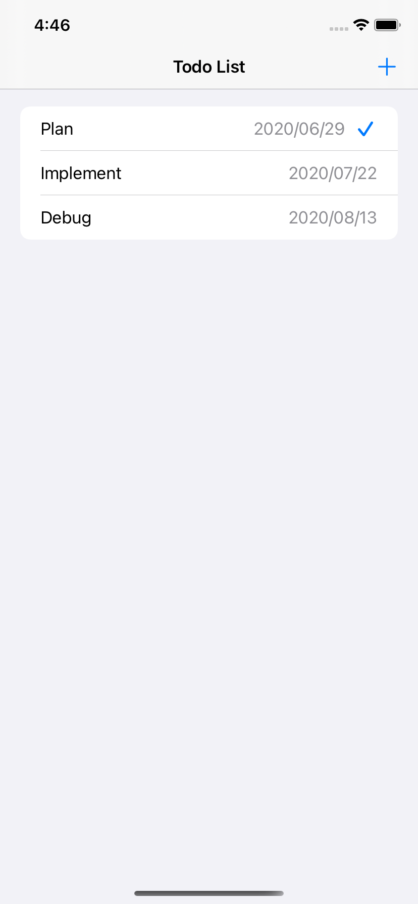
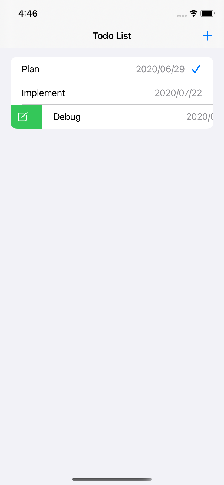
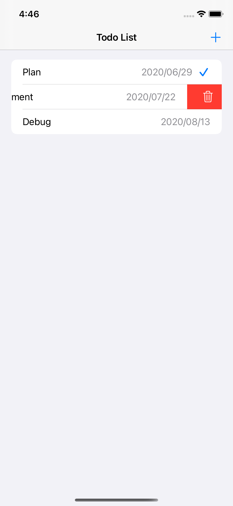
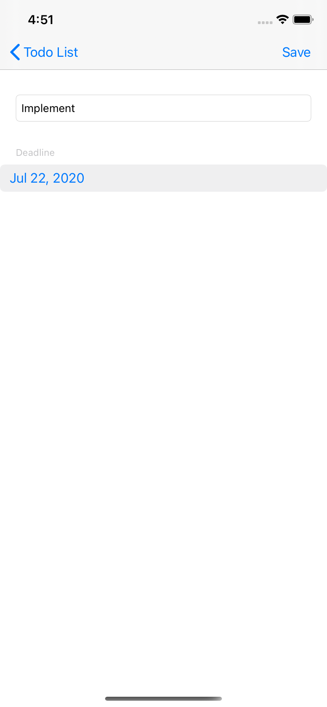
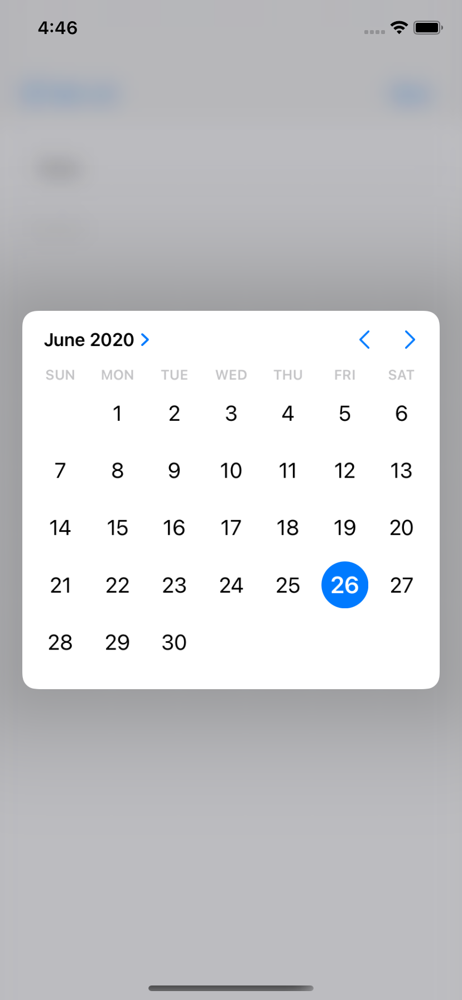

# TodoAppCollectionView Sample

Sample todo app with WWDC20 updates

- use CollectionView with list style (< iOS 14)
- use DiffableDataSource with CoreData (< iOS 13)
- use DatePicker (above iOS14, you can use this with new skin)
- use AccentColor (< iOS 14)
- use Menu (< iOS 14)

## Screenshot

*These screenshots don't reflect the state of the most recent commit, so there are some differences from what it looks like.*

### List screen
| List | Edit Action| Delete Action|
|:---:|:---:|:---:|
||||

### Todo screen
|Todo|Date Picker|
|:---:|:---:|
|||

### Reference

- [CollectionView Sample by Apple](https://developer.apple.com/documentation/uikit/views_and_controls/collection_views/implementing_modern_collection_views)
- [How to use CoreData by me](https://qiita.com/touyoubuntu/items/5133ba503da74bb39063)
- [How to connect CoreData and DiffableDataSource by Julian](https://schiavo.me/2019/coredata-diffabledatasource/)
- Some other developer documents by Apple
- [Movie](https://twitter.com/touyou_dev/status/1276526396035092482)
